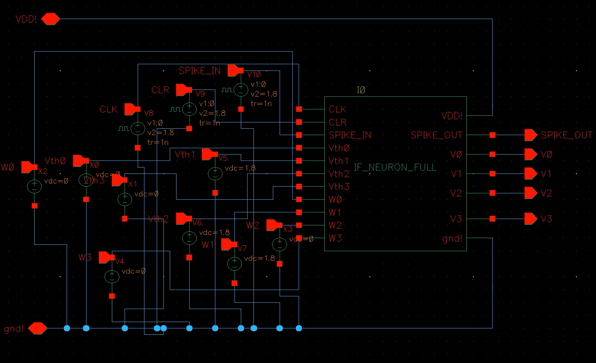
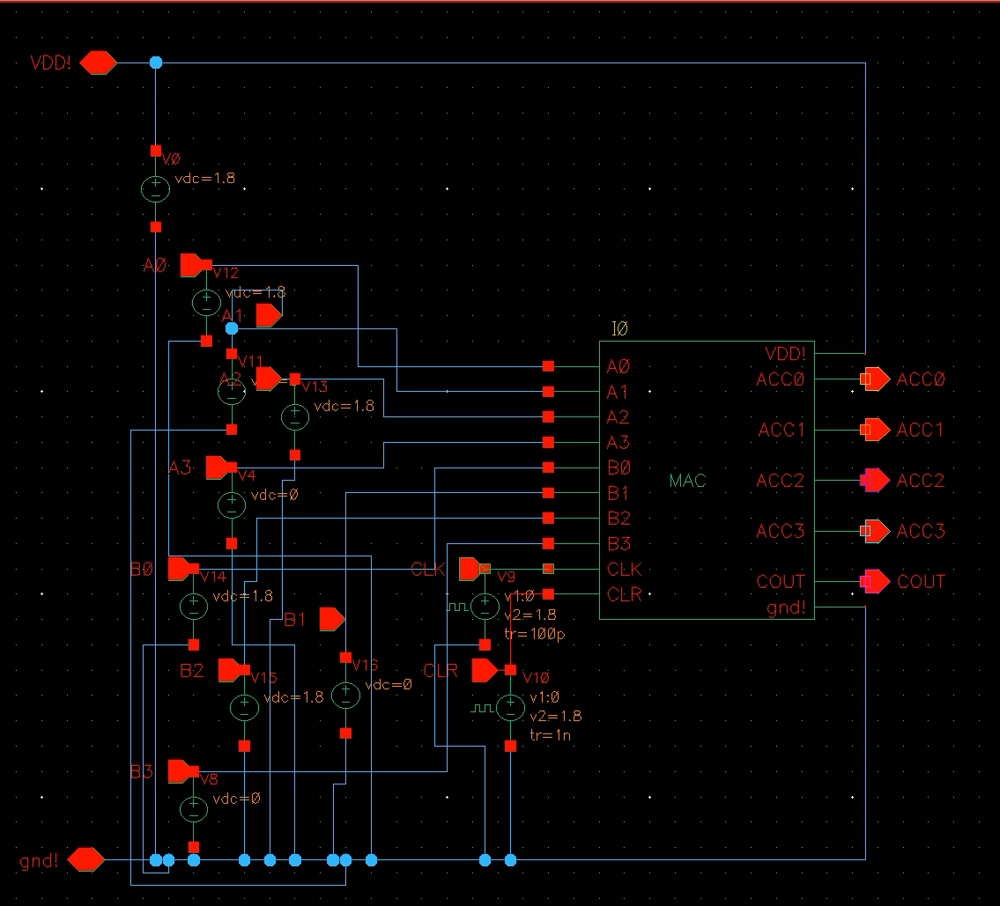
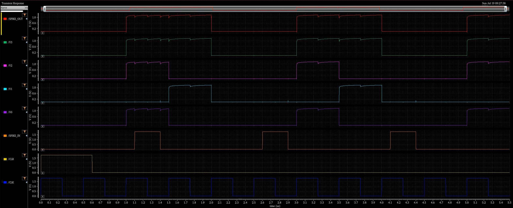
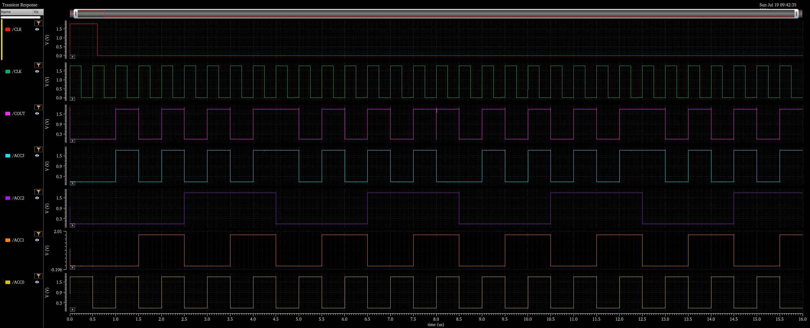

# SNN-ANN 能耗-准确率权衡分析 — 结题报告汇总

## 一、项目目标

本课题设计并验证了一套基于 **Integrate-and-Fire (IF) 神经元** 的脉冲神经网络硬件单元，
包括：
- **MAC 单元**：4×4 乘法器 + 4-bit CLA 加法器 + REG4 寄存器
- **IF 神经元**：MUX4 积分器 + ADD4 + REG4 + CMP_GE 比较器 + SYNC_RESET

核心问题：在 MNIST 手写数字识别任务上，量化 **SNN 相比 ANN 每节省多少功耗，会损失多少准确率**。

---

## 二、硬件电路验证结果

| 模块 | 关键修复 | 验证结论 |
|---|---|---|
| DFF | 修正 Q=~D 的反相问题，确认下降沿触发 | Q=D，CLR 高电平有效 |
| MAC | 确认 4-bit 截断设计，DFF 反相修复 | A=5,B=5 累加序列正确：0→9→2→11→4→13→6… |
| IF 神经元 | MUX4 选择逻辑修正：SPIKE=1 时选 W | V 正确累加 0→2→4→6，SPIKE_OUT 按时触发 |

---

## 三、测试平台与功能验证波形

### 3.1 测试平台电路图

IF 神经元功耗/功能测试平台：



MAC 单元功耗/功能测试平台：



### 3.2 功耗测试波形

IF 神经元在 2MHz 下的功耗测试波形（W=0010, Vth=0110，3 个 SPIKE_IN 脉冲）：



MAC 单元在 2MHz 下的功耗测试波形（A/B 输入翻转）：



### 3.3 功能验证记录

#### DFF

| 验证项 | 预期 | 实测 | 结论 |
|---|---|---|---|
| 触发边沿 | 下降沿触发 | 下降沿触发 | 通过 |
| Q 与 D 关系 | Q = D | Q = D | 通过 |
| CLR 复位 | CLR 高电平时复位 | 0–600 ns 复位有效 | 通过 |

#### MAC 单元

| 编号 | 输入 A | 输入 B | 乘积低 4 位 | 预期 ACC 序列 | 实测结果 | 结论 |
|---|---|---|---|---|---|---|
| 1 | 0000 (0) | 0000 (0) | 0 | 保持 0 | ACC = 0 | 通过 |
| 2 | 0001 (1) | 0000 (0) | 0 | 保持 0 | ACC = 0 | 通过 |
| 3 | 0000 (0) | 0001 (1) | 0 | 保持 0 | ACC = 0 | 通过 |
| 4 | 0001 (1) | 0001 (1) | 1 | 0 → 1 → 2 → 3 … | 每个周期 +1 | 通过 |
| 5 | 0101 (5) | 0101 (5) | 9 | 0 → 9 → 2 → 11 → 4 → 13 → 6 … | 与序列一致 | 通过 |

#### IF 神经元

| 编号 | W | Vth | SPIKE_IN | 预期膜电位 V 序列 | 实测结果 | 结论 |
|---|---|---|---|---|---|---|
| 1 | 0010 (2) | 0110 (6) | 3 个脉冲 | 0 → 2 → 4 → 6 → 0 | V 正确累加，达到阈值后复位 | 通过 |

---

## 四、Cadence 实测功耗、延迟与晶体管数

### 4.1 测试参数记录

#### MAC 功耗 testbench

| 参数 | 数值 | 说明 |
|---|---|---|
| CLK period | 500 ns | 2MHz |
| CLK width | 250 ns | 50% 占空比 |
| CLR width | 600 ns | 0–600 ns 高电平复位 |
| A0–A3 | vpulse 二进制计数 | 周期 1u/2u/4u/8u，A 从 0→15 循环 |
| B0–B3 | vpulse 二进制计数（相位错开） | 周期 1u/2u/4u/8u，与 A 不同相 |
| Stop Time | 16 µs | 共 32 个时钟周期 |
| VDD | 1.8 V | 独立 vdc 接 VDD! 与 gnd! |

MAC 每个时钟周期完成一次乘累加，因此**无需额外事件折算**（折算因子 = 1.0），
测得的平均功耗直接作为单次 MAC 运算功耗。

#### IF 神经元功耗 testbench

| 参数 | 数值 | 说明 |
|---|---|---|
| CLK period | 500 ns | 2MHz，下降沿触发 |
| CLK width | 250 ns | 50% 占空比 |
| CLR width | 600 ns | 0–600 ns 高电平复位 |
| W | 0010 | 权重为 2 |
| Vth | 0110 | 阈值为 6 |
| SPIKE_IN 脉冲 1 | 1.1 µs – 1.4 µs | 宽 300 ns |
| SPIKE_IN 脉冲 2 | 2.6 µs – 2.9 µs | 宽 300 ns |
| SPIKE_IN 脉冲 3 | 4.1 µs – 4.4 µs | 宽 300 ns |
| Stop Time | 5.5 µs | 共 11 个时钟周期，3 个有效脉冲事件 |
| VDD | 1.8 V | 独立 vdc 接 VDD! 与 gnd! |

### 4.2 测量结果

| 指标 | MAC 单元 | IF 神经元 | 备注 |
|---|---|---|---|
| 动态功耗 | 4.876 µW | 2.627 µW | 2MHz，1.8V |
| 静态功耗 | 0.005827 µW | 0.005951 µW | 输入全 1，CLK=0，CLR=0 |
| 未折算有效功耗 | 4.870 µW | 2.621 µW | 动态 - 静态 |
| 折算后有效功耗 | 4.870 µW | 9.611 µW | 未折算 × 3.67 |
| 关键路径延迟 | ~50 ns | ~149 ns | 2MHz 时钟下满足时序 |
| 晶体管数量 | 942 | 514 | 基于 MAC / IF_NEURON_FULL 最终 CDL |
| 单次操作能量 | 2.435 pJ | 4.805 pJ | @ 2MHz |

> **折算说明**：IF 测试窗口 5.5 µs 内只有 3 个有效脉冲事件，因此把测得的平均功耗按
> `11 / 3 ≈ 3.67` 放大，得到“每次脉冲事件”的等效功耗。

### 4.3 面积-延迟-功耗综合对比

#### 单元级对比

| 指标 | MAC 单元 | IF 神经元 | IF / MAC 比值 |
|---|---|---|---|
| 晶体管数量（面积 proxy） | 942 | 514 | 0.546 |
| 关键路径延迟 | ~50 ns | ~149 ns | 2.98 |
| 动态功耗（测试台平均） | 4.876 µW | 2.627 µW | 0.539 |
| 有效单次功耗 | 4.870 µW | 9.611 µW | 1.973 |
| 单次操作能量 | 2.435 pJ | 4.805 pJ | 1.973 |

#### 系统级对比（data_based 推荐配置）

| 系统 | 准确率 | 一次推理能耗 | 相对 ANN 能耗 | 推理周期数 | 延迟 @2MHz | 相对 ANN 延迟 |
|---|---|---|---|---|---|---|
| ANN（串行单 MAC） | 97.0% | 1160.08 mW·cycle | 100% | 238,200 | 119.1 ms | 100% |
| SNN T=50, Vth=0.5 | 96.8% | 15.268 mW·cycle | 1.32% | 50 | 25.0 µs | 0.0210% |
| SNN T=20, Vth=0.75 | 96.0% | 5.651 mW·cycle | 0.49% | 20 | 10.0 µs | 0.0084% |

> 说明：此处 ANN 采用单 MAC 串行基线（parallelism=1）。若 ANN 使用更多 MAC 并行，其延迟会下降，但单位面积功耗会同比上升；本表用于说明 SNN 在事件稀疏性上的数量级优势。

---

## 五、ANN 参考能耗

网络结构：784 → 300 → 10

```text
总 MAC 次数 = 784×300 + 300×10 = 238,200
ANN 能耗    = 4.870 µW × 238,200 = 1160.08 mW·cycle
ANN 准确率  ≈ 97.0%
```

---

## 六、SNN 推荐配置（Pareto 前沿）

### 6.1 data_based 归一化（推荐）

| T | Vth | 准确率(%) | 整体稀疏率(%) | SNN能耗(mW·cycle) | 节能(%) | SNN/ANN(%) |
|---|---|---|---|---|---|---|
| 50 | 0.50 | 96.8 | 89.75 | 15.268 | 98.68 | 1.316 |
| 50 | 0.75 | 96.6 | 89.84 | 15.129 | 98.70 | 1.304 |
| 50 | 1.00 | 96.6 | 89.90 | 15.041 | 98.70 | 1.297 |
| 50 | 1.50 | 96.4 | 89.97 | 14.942 | 98.71 | 1.288 |
| 30 | 1.50 | 96.2 | 90.25 | 8.714 | 99.25 | 0.751 |
| 20 | 0.75 | 96.0 | 90.52 | 5.651 | 99.51 | 0.487 |
| 20 | 1.50 | 95.4 | 90.64 | 5.576 | 99.52 | 0.481 |
| 10 | 0.50 | 94.6 | 91.43 | 2.552 | 99.78 | 0.220 |
| 5 | 0.50 | 92.2 | 93.75 | 0.930 | 99.92 | 0.080 |

**最高准确率配置**：T=50, Vth=0.50，
准确率 96.8%，SNN 能耗为 ANN 的
1.32%。

### 6.2 max_norm 归一化

| T | Vth | 准确率(%) | 整体稀疏率(%) | SNN能耗(mW·cycle) | 节能(%) | SNN/ANN(%) |
|---|---|---|---|---|---|---|
| 100 | 5.00 | 97.0 | 76.70 | 69.428 | 94.02 | 5.985 |
| 50 | 5.00 | 96.8 | 76.83 | 34.519 | 97.02 | 2.976 |
| 30 | 5.00 | 95.8 | 77.03 | 20.526 | 98.23 | 1.769 |
| 10 | 5.00 | 95.6 | 77.92 | 6.578 | 99.43 | 0.567 |
| 5 | 5.00 | 89.6 | 79.68 | 3.026 | 99.74 | 0.261 |

**最高准确率配置**：T=100, Vth=5.00，
准确率 97.0%，SNN 能耗为 ANN 的
5.98%。

---

## 七、IF 功耗折算前后对比

下表展示 **data_based** 方法下，IF 功耗按实际脉冲事件折算前后的 Pareto 结果差异：

| T | Vth | 折算后 P_SNN(mW·cycle) | 折算后节能(%) | 未折算 P_SNN(mW·cycle) | 未折算节能(%) |
|---|---|---|---|---|---|
| 50 | 0.50 | 15.268 | 98.68 | 4.164 | 99.64 |
| 50 | 0.75 | 15.129 | 98.70 | 4.126 | 99.64 |
| 50 | 1.00 | 15.041 | 98.70 | 4.102 | 99.65 |
| 50 | 1.50 | 14.942 | 98.71 | 4.075 | 99.65 |
| 30 | 1.50 | 8.714 | 99.25 | 2.377 | 99.80 |
| 20 | 0.75 | 5.651 | 99.51 | 1.541 | 99.87 |
| 20 | 1.50 | 5.576 | 99.52 | 1.521 | 99.87 |
| 10 | 0.50 | 2.552 | 99.78 | 0.696 | 99.94 |
| 5 | 0.50 | 0.930 | 99.92 | 0.254 | 99.98 |

> 说明：未折算时，把 IF 测试窗口内的平均功耗直接当成“每次事件功耗”，会显著高估 SNN 的节能效果；
> 折算后更贴近事件驱动的真实能耗。

---

## 八、核心结论

1. **data_based 归一化显著优于 max_norm**：在相近准确率下，data_based 的 SNN 能耗更低。
2. **SNN 节能来自事件稀疏性**：即使单次 IF 事件功耗高于单次 MAC，SNN 一次推理的脉冲事件数
   （约 1,000–7,000）远少于 ANN 的 MAC 次数（238,200），因此总量上仍节能 94%–99%。
3. **“节能百分比 vs 准确率下降”曲线存在明显拐点（knee point）**：
   - 从 ANN 切换到 SNN（T=50, Vth=0.5）时，准确率仅下降约 0.2%，即可节能 98.68%，
     这是**性价比最高的区域**。
   - 继续压缩到 T=5 虽然能把节能推到 99.92%，但准确率会再下降约 4.8%，
     属于“为最后一点节能付出过大准确率代价”的区域。
   - 因此，本课题的实用甜点（sweet spot）在 **T=20~50、Vth=0.5~1.5** 之间。
4. **归一化方法对 trade-off 影响巨大**：
   - max_norm 在 T=5、Vth=5.0 时准确率会跌至 12.4%，几乎不可用；
   - 而 data_based 在相近节能水平下仍能保持 92.2% 的准确率。
   - 这说明 **“按数据分布缩放权重”是 SNN 转换成功的关键**。
5. **推荐硬件部署点**（基于全部 Pareto 前沿数据）：
   - 若追求最高准确率：data_based, T=50, Vth=0.50，准确率 96.8%，SNN 能耗为 ANN 的 1.32%，节能 98.68%。
   - 若追求最大节能：data_based, T=5, Vth=0.5，准确率 92.2%，SNN 能耗为 ANN 的 0.08%，节能 99.92%。
   - max_norm 最高准确率：T=100, Vth=5.00，准确率 97.0%，SNN 能耗为 ANN 的 5.98%，节能 94.02%。
6. **时钟频率必须降至 2MHz**：IF 神经元关键路径延迟约 149 ns，超过 10MHz 的 100 ns 周期。
7. **结论基于全部 (T, Vth) 扫描数据**：完整数据表见 `full_results_table.md`，核心曲线见
   `plots/snn_saving_vs_loss_data_based.png`，Pareto 前沿从所有 49 组 data_based 和 49 组 max_norm 配置中计算得出。

---

## 九、关键文件清单

| 文件 | 说明 |
|---|---|
| `snn_conversion.py` | ANN-to-SNN 转换与 IF 神经元仿真 |
| `snn_tradeoff.py` | (T, Vth) 扫描与 CSV/图表生成 |
| `fill_power.py` | 用 Cadence 实测功耗填充 CSV |
| `plot_power_tradeoff.py` | 功耗-准确率 trade-off 可视化 |
| `count_transistors.py` | 自动统计 CDL 晶体管数量 |
| `generate_report.py` | 生成本报告 |
| `snn_tradeoff_data_based.csv` | data_based 完整数据 |
| `snn_tradeoff_max_norm.csv` | max_norm 完整数据 |
| `full_results_table.md` | 全部 (T, Vth) 配置汇总表 |
| `plots/*.png` | 全部 trade-off 图表 |

---

## 十、参考文献与术语说明

### 10.1 参考文献

1. Maass, W. (1997). Networks of spiking neurons: the third generation of neural network models. *Neural Networks*, 10(9), 1659-1671.
2. Diehl, P. U., & Cook, M. (2015). Unsupervised learning of digit recognition using spike-timing-dependent plasticity. *Frontiers in Computational Neuroscience*, 9, 99.
3. Rueckauer, B., Lungu, I. A., Hu, Y., Pfeiffer, M., & Liu, S. C. (2017). Conversion of continuous-valued deep networks to efficient event-driven networks for image classification. *Frontiers in Neuroscience*, 11, 682.
4. Sengupta, A., Ye, Y., Wang, R., Liu, C., & Roy, K. (2019). Going deeper in spiking neural networks: VGG and residual architectures. *Frontiers in Neuroscience*, 13, 95.

### 10.2 术语表

| 术语 | 说明 |
|---|---|
| SNN | Spiking Neural Network，脉冲神经网络 |
| IF 神经元 | Integrate-and-Fire Neuron，积分-发放神经元 |
| MAC | Multiply-Accumulate，乘累加运算 |
| PPA | Power-Performance-Area，功耗-性能-面积 |
| T | 仿真时间步长 |
| Vth | 神经元发放阈值 |
| data_based | 基于数据分布的权重归一化方法 |
| max_norm | 基于最大权重的归一化方法 |

---

*报告生成时间：2026-07-19*
